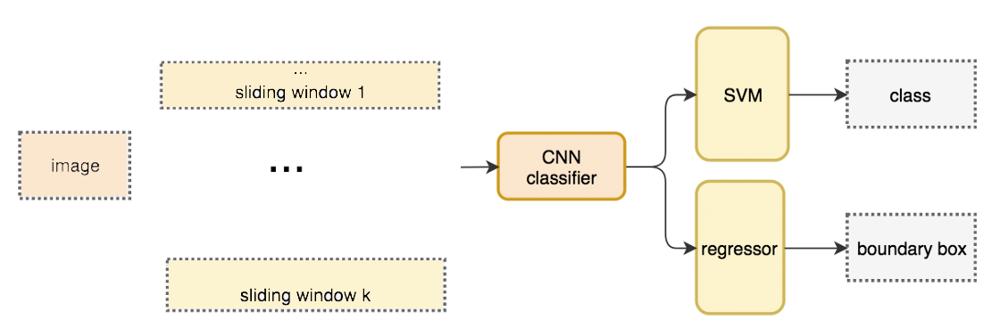
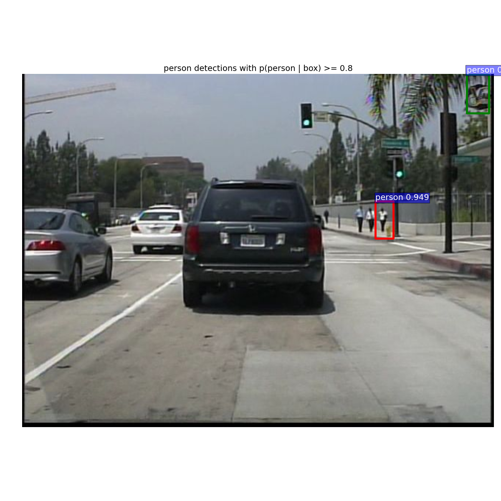
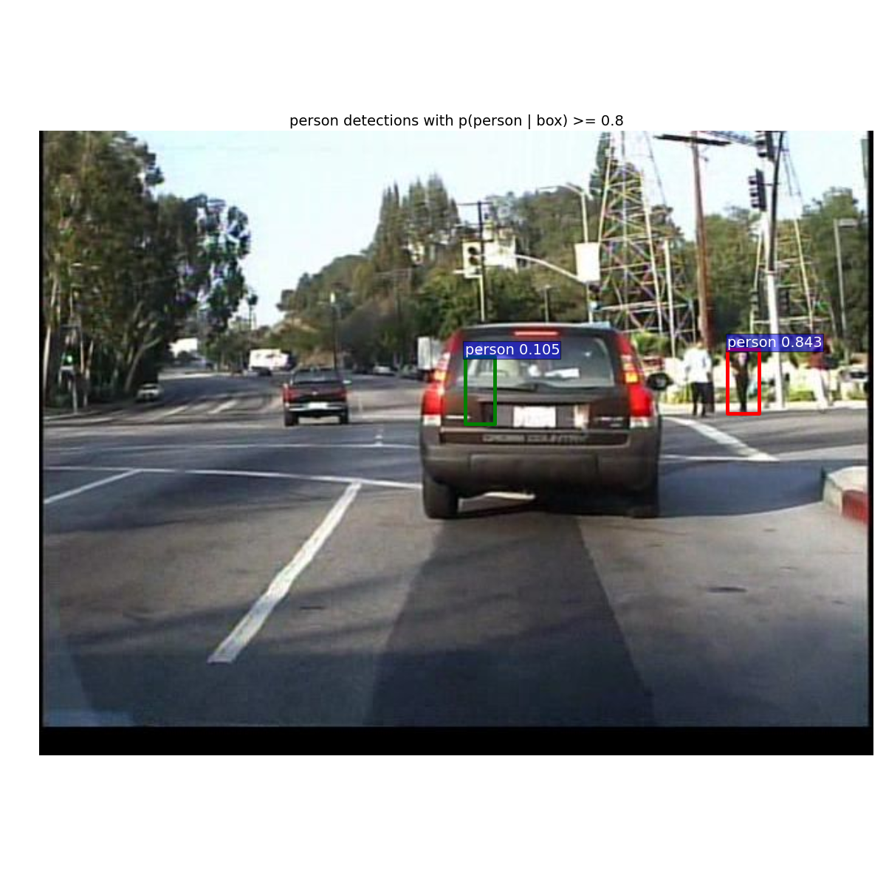
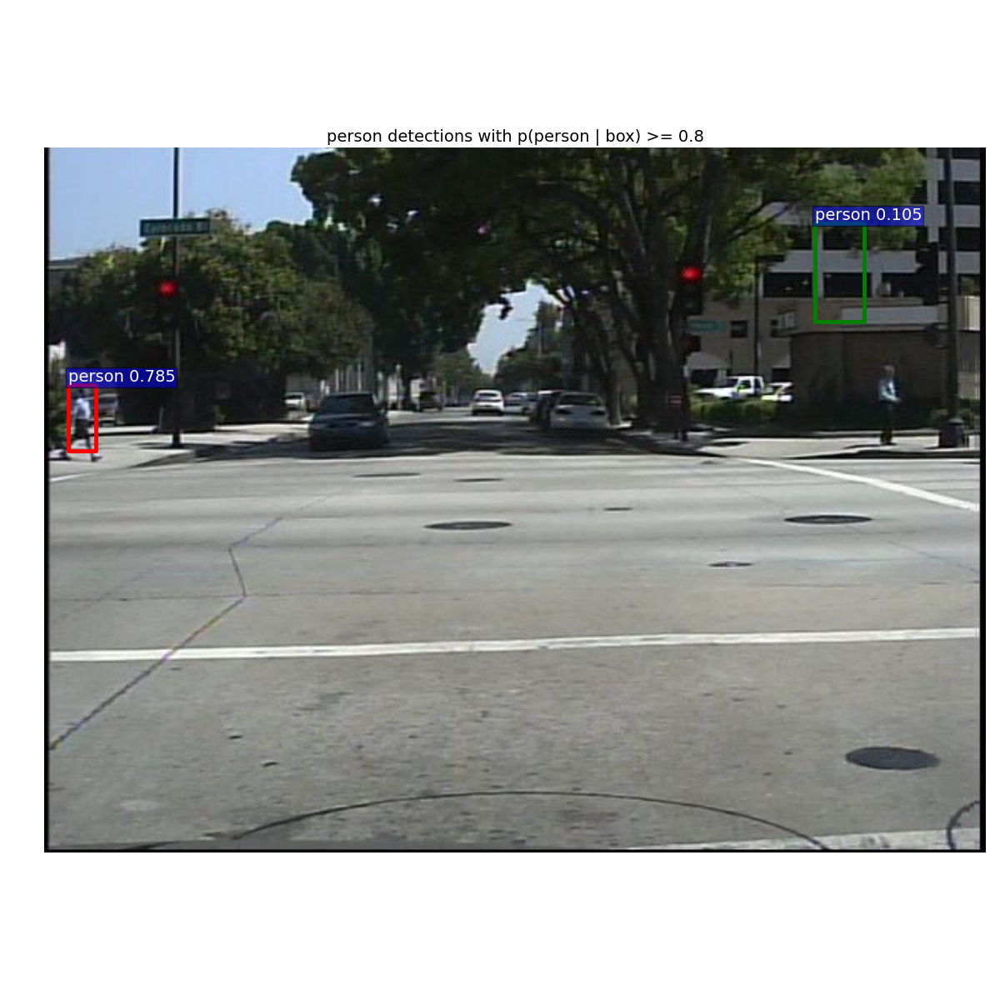

# Pedestrian Detection with Faster-RCNN

## 0 Overview.

In this project, a comprehensive journey on object detection from days before region based convolution neural network to RNN, then Fast R-CNN and eventually Faster R-CNN is taken. In [History and Design Evolution of R-CNN](#1-History-and-Design-Evolution-of-R-CNN]), a brief description and analysis of all key advancements by its own time are included. Before jumping into region based object detectors, old techniques like sliding windows and selective search are demonstrate with a high level understanding. Region based CNNs are then introduced, they, at least the names, sound similar and fight each other for the title of fastest speed and best accuracy but indeed are developed cumulatively; one small step at a time and all gains together result in great achievement.

This report is also a documentation of a Faster R-CNN python re-implementation and Faster R-CNN training on Caltech dataset with `end2end` mechanism and pre-trained VGG16, a detailed instruction on how to prepare the dataset for Faster R-CNN and how to modify the network is included. The attempt to re-implement Faster R-CNN is made and documented in [Faster R-CNN Reimplementation and Analysis of Framework and Key Components](#2-Faster-R-CNN-Reimplementation-and-Analysis-of-Framework-and-Key-Components). Beyond the official re-implementation over Pascal VOC dataset, this project include the efforts to train the Faster R-CNN on pedestrian detection dataset - Caltech; the dataset pre-processing is well documented in [Prepare the Dataset: Caltech](#31-Prepare-the-Dataset-Caltech) and the network modification instruction is in [Model Tuning to Fit Caltech Dataset](#32-Model-Tuning-to-Fit-Caltech-Dataset). The final result of the trained Faster R-CNN on Caltech is not as well as expected but the possible reasons and methods towards improvements are proposed in [Result Evaluation](#332-Result-Evaluation). At the end, some proposals to improve the network structure are also made, like replace the backbone network VGG with Resnet is implemented with a okay result. And newer methos like R-FCN and FRN are also mentioned with short decriptions.

## 1 History and Design Evolution of R-CNN.

Since AlexNet achieved its great success at 2012 in ILSVRC challenge, the application of the Convolution Neural Network for image classification has dominated the field of both research and industry.  Within this topic, a brief review of the developments on object detection techniques will be presented; region based object detectors including R-CNN, Fast R-CNN, Faster R-CNN and R-FCN will be discussed. To sort out the tech-developments through history will not stay as a review only but also provide a better insight of future. 

And this topic content is heavily based on article [What do we learn from region based object detectors (Faster R-CNN, R-FCN, FPN)?](https://medium.com/@jonathan_hui/what-do-we-learn-from-region-based-object-detectors-faster-r-cnn-r-fcn-fpn-7e354377a7c9) post by [@Jonathan Hui](https://medium.com/@jonathan_hui) on Medium.

### 1.0 Before R-CNN: Sliding-windows and Selective-search.

Before all advanced developments in object detection, the solution for applying CNN to object detection  is to slide a windows all over the image and identify objects with classification; and patches from the original images are cut out then to feed in the classification CNN to extract features, inner products to classify and linear regressors for bounding box.



ps. To detect various object  at different viewing distances, windows of various sizes and aspect ratios has been used. The patches are then warped to fit the fixed size classifiers. But this will not impact the classification accuracy since the classifier are trained to handle warped images.

Instead of such a brute method of exhaustion,  a region proposal method to create regions of interest (ROIs) for object detection is raised as selective search (SS). Individual pixel are grouped by calculating the texture and combine the closest ones. 
<!---->
ps. To deal with overlapping groups, smaller ones are grouped first and then merging regions till everything is combined. 

### 1.1 R-CNN.

[publication](https://arxiv.org/pdf/1311.2524v5.pdf) 

[source code](https://github.com/rbgirshick/rcnn)

At the time of its release, R-CNN is the state-of-the-art visual object detection system; it combines bottom-up region proposals with rich features computed by a convolution neural network. R-CNN improved the previous best detection performance on PASCAL VOC 2012 by 30% relative, going from 40.9% to 53.3% mean average precision. 

R-CNN applies region proposal method to create about 2000 ROIs (regions of interest) from each training images. And then these ROIs are wrapped and feed into a CNN network for classification and bounding box regression.


Comparing to the sliding-windows solution, the R-CNN takes fewer but higher quality ROIs and thus runs faster and more accurate.

### 1.2 Fast R-CNN.

[publication](https://arxiv.org/pdf/1504.08083.pdf)

[source code](https://github.com/rbgirshick/fast-rcnn)

Fast R-CNN is a fast framework for object detection with deep ConvNets. Fast R-CNN trains state-of-the-art models, like VGG16, 9x faster than traditional R-CNN and 3x faster than SPPnet, runs 200x faster than R-CNN and 10x faster than SPPnet at test-time, has a significantly higher mAP on PASCAL VOC than both R-CNN and SPPnet, and is written in Python and C++/Caffe.

R-CNN needs many proposals to be accurate and the same reason makes R-CNN slow in both training & test. For instance, 2,000 proposals for each training/testing image and  each proposal is processed by CNN separately which ends with repeating the feature extractions 2,000 times. 

Instead of extracting features for each proposal (image batch) from scratch, a CNN is used to extract features for the whole image first and then apply the region proposal method on the feature maps directly. For example, Fast R-CNN selects the convolution layer conv5 in VGG16 to generate ROIs which later combine with the corresponding feature maps to form patches for object detection. The patches are wrapped to a fixed size using ROI pooling and feed to fully connected layers for classification and detecting the locations. 


By not repeating the feature extractions, Fast R-CNN significantly cuts down the process time. Fast R-CNN advances at the whole network (the feature extractor, the classifier, and the bounding box regressors) can be trained end-to-end with multi-task losses (classification loss and localization loss). This significantly improves accuracy.

### 1.3 Faster R-CNN.

[publication](https://arxiv.org/pdf/1506.01497.pdf)

[source code](https://github.com/ShaoqingRen/faster_rcnn)

Faster R-CNN is an object detection framework based on deep convolution networks, which includes a Region Proposal Network (RPN) and an Object Detection Network. Both networks are trained for sharing convolution layers for fast testing; the official implementation is in matlab. The main result:


|                         | training data                          | test data            | mAP   | time/img|
|:------------------------- |:--------------------------------------:|:--------------------:|:-----:|:-----:|
|Faster RCNN, VGG-16       | VOC 2007 trainval + 2012 trainval      | VOC 2007 test        | 73.2% | 198ms|
|Faster RCNN, VGG-16       | VOC 2007 trainval&test + 2012 trainval | VOC 2012 test        | 70.4% | 198ms|

Fast R-CNN depends on an external CPU based region proposal method which is slow. Faster R-CNN applies the same network design but replaces the region proposal method by an internal deep network. The new region proposal network (RPN) is more efficient and run at 10 ms per image in generating ROIs comparing to 2.3 seconds in Fast R-CNN.

The network flow is the same but the region proposal is now replaced by a convolution network (RPN).


### 1.4 R-FCN and Other State of Art Developments.


## 2  Faster R-CNN Reimplementation and Analysis of Framework and Key Components.

Based on a historical review on all relative developments, this part will implement the Faster R-CNN end to end training and explain how the key components works for the framework to demonstrate an comprehensive understanding of these techniques.

### 2.1 Python Implementation of Faster R-CNN.

This part of work serves as the foundation of this project, and thanks to [@rbgirshick](https://github.com/rbgirshick) for the detailed documentation, this is no much difficulty in reimplementing the work but following the [tutorial](https://github.com/rbgirshick/py-faster-rcnn) carefully, and one thing to clarify is the end to end method (not the multi-stage) is taken in all implementations in this project.

And the result running on a linux sever with *Nvidia GeForce GTX 1080Ti* is attached here:

```shell
VOC07 metric? Yes
AP for aeroplane = 0.6580
AP for bicycle = 0.6718
AP for bird = 0.5780
AP for boat = 0.4262
AP for bottle = 0.3364
AP for bus = 0.6378
AP for car = 0.7389
AP for cat = 0.7173
AP for chair = 0.4074
AP for cow = 0.6608
AP for diningtable = 0.6166
AP for dog = 0.6584
AP for horse = 0.7627
AP for motorbike = 0.6928
AP for person = 0.6683
AP for pottedplant = 0.3271
AP for sheep = 0.6080
AP for sofa = 0.5743
AP for train = 0.7008
AP for tvmonitor = 0.6637
Mean AP = 0.6053
~~~~~~~~
Results:
0.658
0.672
0.578
0.426
0.336
0.638
0.739
0.717
0.407
0.661
0.617
0.658
0.763
0.693
0.668
0.327
0.608
0.574
0.701
0.664
0.605
~~~~~~~~
```

This the mAP here matches the result presented in the Faster R-CNN paper, which is `mAP = 59.2% for RPN + VGG network`. Therefore, the Faster R-CNN is successfully re-implemented.

### 2.2 The RoIPooling Layer for Fast and Faster R-CNN.
(*The answer to question 01 is included here: "Please describe the 2 key components in the Faster R-CNN framework: the RoIPooling layer"*)

RoIPooling is a max pooling layer take region of interest features as input and output smaller size feature maps.


The regions of interest come in different sizes but the following fully connected layers take fixed size input, thus the RoIPooling should pool the different size inputs into same fixed size output. The mechanism being used is to divide the input with a grid same size as the output; for various input sizes $(H_i * W_i)$  and fixed output size $(H_o * W_o)$, a $(H_o * W_o)$ grid with cell size $(\frac{H_i }{H_o }* \frac{W_i} {W_o})$ will be applied to the inputs and  the max value in each cell will be taken as the responding value for output.

For example, Fast R-CNN selects the convolution layer conv5 in VGG16 to generate ROIs which later combine with the corresponding feature maps to form patches for object detection. The patches are wrapped to a fixed size 7\*7 using ROI pooling and feed to fully connected layers for classification and detecting the locations.

### 2.3 The Loss Function.
(*The answer to question 01 is included here: "Please describe the 2 key components in the Faster R-CNN framework: the Loss Function"*)

Fast and Faster R-CNN advances at the whole network (the feature extractor, the classifier, and the boundary box regressor) can be trained end-to-end with multi-task losses (classification loss and localization loss). 

The so called multi-task loss is simply the sum of the classification loss and the bounding-box regression loss. Following formula: \\[L(p, u, t^u, v) = L_{cls}(p,u) + \lambda[ u \geq 1]L_{loc}(t^u,v) \\]where $L_{cls}(p,u)$ is classification loss for each RoI and using log loss $L_{cls}(p,u) = -logp_u$ and the second part is for bounding-box regression loss; the $\lambda[u\geq 1]$is a conditional factor: $\lambda= \left\{\begin{matrix}
1, u \geq 1\\ 
0, u < 1
\end{matrix}\right.$ when the classification score u is greater or equal to one means the object is correctly classified then the bounding-box regression loss is added to the multi-task loss, however if the u is less than one and the object is not well classified the $\lambda$ is set to zero and the bounding-box loss will not be included.

And the bounding-box regression loss is calculate with formula: \\[L_{loc}(t^u,v) = \sum_{i\in \{x,y,w,h\}}smooth_{L1}(t^u - v_i)\\] where the smooth function is: 


simply takes the ground-truth bounding box $v_i$ and compute $L_{loc}$ with the generated $t^u$.

## 3 Re-implement Faster RCNN with Pedestrian Detection Dataset.

The python faster R-CNN implementation from [@rbgirshick](https://github.com/rbgirshick) works with `Pascal Voc `dataset while this project aims at pedestrian detecting. Thus, to adapt the existed implementation to pedestrian dataset like `Caltech, Kitti and INRIA` is the essential part for implementing. And in this report, how to prepare the Caltech dataset will first be introduced. And how to modify the network model will then be explained.  The last topic will be the performance analysis and demonstration of the trained network.

And this part of work is heavily based on [py-faster-rcnn-caltech-pedestrian](https://github.com/govindnh4cl/py-faster-rcnn-caltech-pedestrian).

### 3.1 Prepare the Dataset: Caltech.

The [Caltech](http://www.vision.caltech.edu/Image_Datasets/CaltechPedestrians/) pedestrian dataset consists of approximately 10 hours of 640x480 30Hz video taken from a vehicle driving through regular traffic in an urban environment. About 250,000 frames (in 137 approximately minute long segments) with a total of 350,000 bounding boxes and 2300 unique pedestrians were annotated. The annotation includes temporal correspondence between bounding boxes and detailed occlusion labels. 

In order to use Caltech dataset for Faster R-CNN,  3 essential parts of data need to be obtained/converted from the raw data: Annotations, ImageSets, JPEGImages, which are the label data, text file with images name as lists and images in jpg format respectively. In this project, 8 sub-steps are implemented to obtain the required data. 

#### 3.1.1 Create directory structure.

Before making the dataset, design and create the directories structure to make it easy for coming data parses and extracts operations.

``` Shell
mkdir caltech;
cd caltech
mkdir downloaded         # Store downloaded setxx.tar
mkdir unzip              # Store unzipped setxx folder
mkdir data               
mkdir data/JPEGImages    # Store prepared images
mkdir data/ImageSets     # Store image name txt file
```

#### 3.1.2 Get the video sequences and annotations.

The dataset can be downloaded from the official site `https://www.vision.caltech.edu/Image_Datasets/CaltechPedestrians/datasets/USA/setXX.tar` with commands:

```Shell
wget https://www.vision.caltech.edu/Image_Datasets/CaltechPedestrians/datasets/USA/set00.tar
wget https://www.vision.caltech.edu/Image_Datasets/CaltechPedestrians/datasets/USA/set01.tar
wget https://www.vision.caltech.edu/Image_Datasets/CaltechPedestrians/datasets/USA/set02.tar
wget https://www.vision.caltech.edu/Image_Datasets/CaltechPedestrians/datasets/USA/set03.tar
wget https://www.vision.caltech.edu/Image_Datasets/CaltechPedestrians/datasets/USA/set04.tar
wget https://www.vision.caltech.edu/Image_Datasets/CaltechPedestrians/datasets/USA/set05.tar
wget https://www.vision.caltech.edu/Image_Datasets/CaltechPedestrians/datasets/USA/set06.tar
wget https://www.vision.caltech.edu/Image_Datasets/CaltechPedestrians/datasets/USA/set07.tar
wget https://www.vision.caltech.edu/Image_Datasets/CaltechPedestrians/datasets/USA/set08.tar
wget https://www.vision.caltech.edu/Image_Datasets/CaltechPedestrians/datasets/USA/set09.tar
wget https://www.vision.caltech.edu/Image_Datasets/CaltechPedestrians/datasets/USA/set10.tar
wget https://www.vision.caltech.edu/Image_Datasets/CaltechPedestrians/datasets/USA/annotations.zip
```
Or for this assignment, all tars packages are preloaded to `/DataA/PublicDataSet/LAB2` and can be copied to `caltech/data` with:

```Shell
cp -r /DataA/PublicDataSet/LAB2 .
```

#### 3.1.3 Extract tars into the directory `unzip`.

Extract(unzip) `setxx.tar` to directories with commands:

```Shell
tar -xf downloaded/set00.tar --directory unzip/
tar -xf downloaded/set01.tar --directory unzip/
tar -xf downloaded/set02.tar --directory unzip/
tar -xf downloaded/set03.tar --directory unzip/
tar -xf downloaded/set04.tar --directory unzip/
tar -xf downloaded/set05.tar --directory unzip/
tar -xf downloaded/set06.tar --directory unzip/
tar -xf downloaded/set07.tar --directory unzip/
tar -xf downloaded/set08.tar --directory unzip/
tar -xf downloaded/set09.tar --directory unzip/
tar -xf downloaded/set10.tar --directory unzip/
```

The  `caltech/downloaded` directory can be removed with command:

```Shell
rm -r downloaded
```
And the directories presents as:

```Shell
caltech/unzip
caltech/unzip/set00
...
caltech/unzip/set10

caltech/unzip/set00/V000.seq
...
caltech/unzip/set00/V010.seq
...
```

#### 3.1.4 Extract the `annotations.zip` file.

Unzip and extract `caltech/annotations.zip` to `caltech/data/annotations` directory; and ten `setxx` directory will be placed in `caltech/data/annotations`.

```Shell
cd data
unzip ../annotations.zip .  
```	  
With in all `setxx` directories, there are many `vxxx.vbb`files. The directories now should be:

```Shell
caltech/data/annotations

caltech/data/annotations/set00
caltech/data/annotations/set01
...
caltech/data/annotations/set10

caltech/data/annotations/set00/V000.vbb
...
caltech/data/annotations/set00/V008.vbb
...
```

#### 3.1.5 Parse and extract images to `caltech/data/JPEGImages`.

Convert and parse images from sequences with tool provided by [caltech-pedestrian-dataset-converter](https://github.com/govindnh4cl/caltech-pedestrian-dataset-converter); Clone the converter to data directory and then modify the code by adding the source and target directories (for my case, ../unzip and JPEGImages respectively) to `config.py`.
Script:

```Shell
cd data
git clone https://github.com/govindnh4cl/caltech-pedestrian-dataset-converter
# caltech-pedestrian-dataset-converter will be added to data folder
cp caltech-pedestrian-dataset-converter/scripts/config.py .
cp caltech-pedestrian-dataset-converter/scripts/convert_seqs.py .
# vim config.py
# Update source caltech/unzip and target caltech/data/JPEGImages directories
```
And these two lines in `config.py` need to be modified:

```Python
self.src_base_dir = '../unzip'
self.dst_base_dir = 'JPEGImages'
```
Then run convert_seq.py with command:

```Shell
python convert_seqs.py #convert.py for parsing and extracting images
```

Multiple `setxx` directories will be created in `JPEGImages` and contains multiple `Vxxx` directories which in-turn containing multiple `.jpg` images. The `caltech-pedestrian-dataset-converter` directory can be removed. And the directories presents as:

```Shell
data/JPEGImages

data/JPEGImages/set00
...
data/JPEGImages/set10


data/JPEGImages/set00/V000
...
data/JPEGImages/set00/V014

data/JPEGImages/set00/V000/0.jpg
...
data/JPEGImages/set00/V000/578.jpg
...
data/JPEGImages/set00/V000/1663.jpg
...
```
The modified `config.py` code is attached here:

```python
# config.py
import os

class Config():
  def __init__(self):
      #  ------ User configurable parameters START -----
      # A list of all sets to be parsed
      self.sets = ['set00', 'set01', 'set02', 'set03', 'set04',
                   'set05', 'set06', 'set07', 'set08', 'set09', 'set10']

      # sets = ['set00', 'set01', 'set02', 'set03', 'set04', 'set05'] #train
      # sets = ['set06', 'set07', 'set08','set09', 'set10'] #test

      # print_names_only: If set, does not write files on disk. Just prints their names on console.
      # Used for generating a file containing the names of images relative to the
      # base path(without extension, but includes prefix e.g. 'set01/V000/' )
      self.print_names_only = False  # Default: False

      # Make interval 1 if want to print all file names
      # Used for generating 1x, 10x training/test set for caltech dataset
      if self.print_names_only:
          self.interval = 30

      # src_base_dir should have unzipped 'set00', 'set01' .. 'set09' and 'annotations' directories
      self.src_base_dir = '../unzip'
      # dst_base_dir must exist. Should be empty
      self.dst_base_dir = 'JPEGImages'

      #  ------ User configurable parameters END -----

      self.src_ann_dir = 'annotations'
      self.dst_ann_file = 'annotations.json'  # Output annotation file name

      ## Video dump parameters.
      # Directory where labelled video will be written. Will be created.
      self.video_dump_dir = 'video_dump'
      self.bbox_color = (0, 0, 255)  # (B, G, R)

      if self._test_config() is False:
          print('Configuration Failed. Correct values set in config.py')

  def _test_config(self):
      """
      Tests the validity of configuration
      :return: True if success. Else False
      """
      if not os.path.exists(self.src_base_dir):
          print('Source dir: {:s} does not exist.'.format(self.src_base_dir))
          return False

      if not os.path.exists(self.dst_base_dir):
          print('Destination dir: {:s} does not exist.'.format(self.dst_base_dir))
          return False

      return True
```

#### 3.1.6 Create ImageSets.

Image sets are the text files containing the image names for train and test sets. Modify the `config.py` and convert:

* Set `print_names = 1`
* Edit the `sets` list for respective set names to be included.
* Set `interval` based on whether 1x or 10x set is to be generated for Caltech dataset.

Generation of 1x training set:
(`print_names = 1; sets = ['set00', 'set01', 'set02', 'set03', 'set04', 'set05']; interval = 30;`)

```Shell
$python convert_seqs.py > ImageSets/train_1x.txt
```
Generation of 1x test set:
(`print_names = 1; sets = ['set06', 'set07', 'set08','set09', 'set10']; interval = 30;`)

```Shell
$python convert_seqs.py > ImageSets/test_1x.txt
```
Generation of 10x training set(optional):
(`print_names = 1; sets = ['set00', 'set01', 'set02', 'set03', 'set04', 'set05']; interval = 3;`)

```Shell
$python convert_seqs.py > ImageSets/test_10x.txt
```
The `unzip` directory can be deleted now. And the responding directory presents as:

```Shell
caltech/data/ImageSets
caltech/data/ImageSets/test_1x.txt
caltech/data/ImageSets/train_1x.txt
```
Code for generating imageset txt file; the attached one is for generating train_1x.txt and to generate test_1x.txt uncomment

```shell
# self.sets = ['set06', 'set07', 'set08','set09', 'set10'] #test
```
and comment:

```Shell
self.sets = ['set00', 'set01', 'set02', 'set03', 'set04', 'set05'] #train
```
Code for generating train_1x.txt.

```python
# generate train_1x.txt
# shell command: python convert_seqs.py > ImageSets/train_1x.txt
import os

class Config():
    def __init__(self):
        #  ------ User configurable parameters START -----
        # A list of all sets to be parsed
        # self.sets = ['set00', 'set01', 'set02', 'set03', 'set04',
        #              'set05', 'set06', 'set07', 'set08', 'set09', 'set10']

        self.sets = ['set00', 'set01', 'set02', 'set03', 'set04', 'set05'] #train
        # self.sets = ['set06', 'set07', 'set08','set09', 'set10'] #test

        # print_names_only: If set, does not write files on disk. Just prints their names on console.
        # Used for generating a file containing the names of images relative to the
        # base path(without extension, but includes prefix e.g. 'set01/V000/' )
        self.print_names_only = True  # Default: False

        # Make interval 1 if want to print all file names
        # Used for generating 1x, 10x training/test set for caltech dataset
        if self.print_names_only:
            self.interval = 30

        # src_base_dir should have unzipped 'set00', 'set01' .. 'set09' and 'annotations' directories
        self.src_base_dir = '../unzip'
        # dst_base_dir must exist. Should be empty
        self.dst_base_dir = 'JPEGImages'

        #  ------ User configurable parameters END -----

        self.src_ann_dir = 'annotations'
        self.dst_ann_file = 'annotations.json'  # Output annotation file name

        ## Video dump parameters.
        # Directory where labelled video will be written. Will be created.
        self.video_dump_dir = 'video_dump'
        self.bbox_color = (0, 0, 255)  # (B, G, R)

        if self._test_config() is False:
            print('Configuration Failed. Correct values set in config.py')

    def _test_config(self):
        """
        Tests the validity of configuration
        :return: True if success. Else False
        """
        if not os.path.exists(self.src_base_dir):
            print('Source dir: {:s} does not exist.'.format(self.src_base_dir))
            return False

        if not os.path.exists(self.dst_base_dir):
            print('Destination dir: {:s} does not exist.'.format(self.dst_base_dir))
            return False

        return True
```

#### 3.1.7 The prepared dataset.

After all previous operations, the dataset has been downloaded and parse to  an applicable format and the directory structure presents as:

```Shell
$caltech/data/
$caltech/data/annotations/
$caltechdata/annotations/set00/
$caltech/data/annotations/set01/
$...
$caltech/data/annotations/set10/
$caltech/data/JPEGImages
$caltech/data/JPEGImages/set00
$caltech/data/JPEGImages/set01
$...
$caltech/data/JPEGImages/set10
$caltech/data/ImageSets/train_1x.txt
$caltech/data/ImageSets/test_1x.txt
```

#### 3.1.8 Create syn links for the dataset.

Then build soft link to the prepared dataset in the `caltech/data` directory with commands:

```Shell
cd caltech/data
ln -s ../caltech caltech
```

### 3.2 Model Tuning to Fit Caltech Dataset.

Like mentioned before this project is based on the `py-faster-rcnn-caltech-pedestrian` project but with many modifications, both code and structure wise.

#### 3.2.0 Clone Repo, Make Caffe and Download pre-trained ImageNet models with Standard Process.

First clone the project from `https://github.com/govindnh4cl/py-faster-rcnn-caltech-pedestrian` and then build caffe.

```shell
git clone --recursive https://github.com/govindnh4cl/py-faster-rcnn-caltech-pedestrian.git
cd py-faster-rcnn-caltech-pedestrian
git checkout master

cd py-faster-rcnn-caltech-pedestrian/lib
make

cd py-faster-rcnn-caltech-pedestrian/caffe-fast-rcnn
cp Makefile.config.example Makefile.config
make -j128 && make pycaffe

cd ../
./data/scripts/fetch_faster_rcnn_models.sh
```

#### 3.2.1 Build Caffe with Support to Python Layer.

If the Caffe is built with the standard process, one issue ([can be referred to official faster rcnn git issue 31](https://github.com/rbgirshick/fast-rcnn/issues/31))  shows like `Check failed: registry.count(type) == 1 (0 vs. 1) Unknown layer type: Python` will occur and the solution is to modify the Makefile.config file by uncomment `WITH_PYTHON_LAYER := 1` in the Makefile.config and remake Caffe.

```shell
make clear
make -j128 && make pycaffe
```
The Caffe is then remade and supports python layers.

#### 3.2.2 Modify the Network to Fit Caltech Dataset.
With the unmodified code, the other issue will be when running the code to 10000 iters, the following error message will pop up and terminate the training: 

```shell
File "./tools/train_net.py", line 112, in <module>
max_iters=args.max_iters)
File "/home/deeplearning_3/Aven_caltech/py-faster-rcnn-caltech-pedestrian/tools/../lib/fast_rcnn/train.py", line 160, in train_net model_paths = sw.train_model(max_iters)
File "/home/deeplearning_3/Aven_caltech/py-faster-rcnn-caltech-pedestrian/tools/../lib/fast_rcnn/train.py", line 111, in train_model model_paths.append(self.snapshot())
File "/home/deeplearning_3/Aven_caltech/py-faster-rcnn-caltech-pedestrian/tools/../lib/fast_rcnn/train.py", line 73, in snapshot self.bbox_stds[:, np.newaxis])
ValueError: operands could not be broadcast together with shapes (84,4096) (8,1)
``` 
This is also an issue can be found on git issues([issue 37](https://github.com/rbgirshick/fast-rcnn/issues/37)) and the solution is relatively complicated. In short, the main issue is Caltech dataset has only two classes comparing with 21 from the original pascal voc dataset, the output layers like `cls_score` and `bbox_pred` have to be modified to fit the dataset; and for this case, the output params for `cls_score` should be 2 and 8 for `bbox_pred` layer. Another further work is to modify the layer name in prototxt and the corresponding class/function name in python layer definition code(I don't fully get the reason but it turns out to be essential).

Three essential files here need to be modified;

* `models/pascal_voc/VGG16/faster_rcnn_end2end/train.prototxt`; Change the output params for `cls_score` and `bbox_pred`  layers: `num_output: 2` and `num_output: 8`.
*  `models/pascal_voc/VGG16/faster_rcnn_end2end/train.prototxt`; Change the output params for `roi-data` layer: `num_classes: 2`
* `models/pascal_voc/VGG16/faster_rcnn_end2end/train.prototxt`; Change the name for `cls_score` and `bbox_pred`  layers to a new name like `new_cls_score` and `new_bbox_pred` .
* `lib/fast_rcnn/train.py`; Change the function name/ parameter name from `cls_score` and `bbox_pred`  to  `new_cls_score` and `new_bbox_pred`.
* `models/pascal_voc/VGG16/faster_rcnn_end2end/test.prototxt`; Change the output params for `cls_score` and `bbox_pred`  layers: `num_output: 2` and `num_output: 8`.
* `models/pascal_voc/VGG16/faster_rcnn_end2end/test.prototxt`; Change the name for `cls_score` and `bbox_pred`  layers to a new name like `new_cls_score` and `new_bbox_pred` .
* `lib/fast_rcnn/test.py`; Change the function name/ parameter name from `cls_score` and `bbox_pred`  to  `new_cls_score` and `new_bbox_pred`.

The last error will happen after the network is trained and right before the testing is 

```shell
test_net.py: error: argument --net: expected one argument
```
this is because  in the `.sh` code there is one more argument required to be passed in, simply delete or comment the last line `  \${EXTRA_ARGS}`, the forward slash at the end of code `  --cfg experiments/cfgs/faster_rcnn_end2end.yml ` should also be removed, can fix the issue.
 
Change the `ITERS=80000` in `experiments/scripts/faster_rcnn_end2end.sh`  to control training iterations, it's good practice to test with a small iters number like `ITERS=100` and move to `ITERS=80000` for final training.

*if simply wants to train over Caltech, the following step is not necessary; and the following command should start the training properly:*

```shell
./experiments/scripts/faster_rcnn_end2end.sh 0 VGG_16 caltech \
--set EXP_DIR seed_rng1701 RNG_SEED 1701
```

In order to keep both pascal_voc and caltech and train them separately,  before edit the prototxt file:

* First `cp -r pascal_voc caltech` and modify `lib/fast_rcnn/config.py` to use `caltech`:

```python
# Model directory
__C.MODELS_DIR = osp.abspath(osp.join(__C.ROOT_DIR, 'models', 'caltech'))
```

* Then modify `experiments/scripts/faster_rcnn_end2end.sh` to use `caltech`:

```shell
PT_DIR="caltech"
```

*  and for trainning command pass in prameters like:

```shell
./experiments/scripts/max_faster_rcnn_end2end.sh 0 VGG_16 caltech \
--set EXP_DIR seed_rng1701 RNG_SEED 1701
```

Everything should be set and the model training starts here.

### 3.3 Performance and Evaluation: mAp and demos.

The log file is attached at the end of this report, and some of the essential info is listed here.

``` shell
im_detect: 1/4088 0.259s 0.000s
im_detect: 2/4088 0.184s 0.000s
im_detect: 3/4088 0.160s 0.000s
...
im_detect: 4086/4088 0.106s 0.000s
im_detect: 4087/4088 0.106s 0.000s
im_detect: 4088/4088 0.106s 0.000s
Evaluating detections
Writing person caltech results file
Saving cached annotations to /home/deeplearning_1/aven_caltech_mini/py-faster-rcnn-caltech-pedestrian/data/caltech/annotations_cache/annots.pkl
AP for person = 0.4963
Mean AP = 0.4963
~~~~~~~~
Results:
0.496
0.496
~~~~~~~~
```

#### 3.3.1 mAP(Mean Average Precision).
(*The answer to question 02 is provided here: "Please describe the object detection performance metric, mAP (Mean Average Precision), and explain why it can well reflect the object detection accuracy."*)

This part of work is heavily based on [mAP (mean Average Precision) for Object Detection](https://medium.com/@jonathan_hui/map-mean-average-precision-for-object-detection-45c121a31173).

In an Object Detection Problem, for example, given an images, find the objects and locate their position and classify them. And object detection models are usually trained on a fixed set of classes, so the model would locate and classify only those classes in the image, and also the location of the object is generally in the form of a bounding box. So, object detection involves both localization of the object in the image and classifying that object. Mean Average Precision aka mAP, as described below, is particularly used for algorithms predicting the locations of the objects along with the classes. 

##### 3.3.1.1 Image Data for Object Detection.

For any algorithm, the metrics are always evaluated in comparison to the ground truth data; the ground truth information for the Training, Validation and Test datasets. For object detection problems, the ground truth includes the image, the classes of the objects and the true bounding boxes of each of the objects in that image. 

A sample data:


|Class	|X coordinate	|Y coordinate	|Box Width	|Box Height|
|----------------|---------------|-----------|---|---|
|Dog	|100	|600	|150	|100|
|Horse	|700	|300	|200	|250|
|Person	|400	|400	|100	|500|

##### 3.3.1.2 IoU aka Intersection over Union.

The model would return lots of predictions, but out of those, most of them would have a very low correctness score associated, hence only predictions with correctness score above a threshold will be considered. The metric that tells the correctness of a given bounding box is the - IoU - Intersection over Union. 

Intersection over Union is a ratio between the intersection and the union of the predicted boxes and the ground truth boxes. To get the intersection and union values, first overlay the prediction boxes over the ground truth boxes, and then the area overlapping the prediction box and ground truth box is the intersection area and the total joint area is the union. For example:


The IoU will then be calculated like this:


##### 3.3.1.3 Identifying correct detections and calculating precision and recall.

For calculating Precision and Recall, as with all machine learning problems, True Positives, False Positives, True Negatives and False Negatives should be identified. IoU is used to get True Positives and False Positives; if the detection(a Positive) is correct(True) or not(False),  take threshold as 0.5 for IoU, if the IoU is > 0.5, it is considered a True Positive, else it is considered a false positive. The IoU = 0.5 is also the PASCAL VOC metric. Since every part of the image where doesn't predict an object is considered a negative, for calculating Recall, just count the Negatives. But measuring “True” negatives is a bit futile. So only measures “False” Negatives which are objects that model missed out. Also, another factor that is taken into consideration is the confidence that the model reports for every detection. Varying the confidence threshold can change whether a predicted box is a Positive or Negative. Basically, all predictions(Box+Class) above the threshold are considered Positive boxes and all below it are Negatives.

For every image, ground truth data tells us the number of actual objects of given classes in that image.By calculating the IoU with the Ground truth for every Positive detection box that the model reports and compare with IoU threshold(like 0.5), the number of correct detections (TP, True Positives) for each class in an image can be calculated. This is used to calculate the Precision for each class  $Precision = {TP\over TP+FP}$ where TP + FP is simply the count of all predictions. And the Recall of the model for certain class is calculated by formula: $Recall = {TP \over TP+FN}$

##### 3.3.1.4 Calculating the Mean Average Precision

When testing, compute precision and recall (for each class) accumulatively and draw precision over recall graph:


the area under the precision-recall curve is the final AP for the class. And the mean average  precision is the average mean of all APs.

#### 3.3.2 Final mAP Performance and Demo Samples.
(*The answer to question 03 is provided here: "Please train and test the Fast R-CNN framework on one of the existing pedestrian detection datasets, and report the final mAP performance that you have achieved.  The dataset could be Caltech, INRIA, KITTI . Please also report some pedestrian detection examples by including the images and bounding boxes."*)
Final mAP:

```shell
AP for person = 0.4963
Mean AP = 0.4963
~~~~~~~~
Results:
0.496
0.496
~~~~~~~~
```

To demonstrate the train model over sample images on the headless server, the output images can not be displayed but saved . And some  modifications have to be done to the `demo.py` code.

Partial python code attached here:

```python
def vis_detections(im,image_name, class_name, dets, thresh=0.5):
    """Draw detected bounding boxes."""
    inds = np.where(dets[:, -1] >= thresh)[0]
    if len(inds) == 0:
        return

    im = im[:, :, (2, 1, 0)]
    fig, ax = plt.subplots(figsize=(12, 12))
    ax.imshow(im, aspect='equal')
    for i in inds:
        bbox = dets[i, :4]
        score = dets[i, -1]

        ax.add_patch(
            plt.Rectangle((bbox[0], bbox[1]),
                          bbox[2] - bbox[0],
                          bbox[3] - bbox[1], fill=False,
                          edgecolor='red', linewidth=3.5)
            )
        ax.text(bbox[0], bbox[1] - 2,
                '{:s} {:.3f}'.format(class_name, score),
                bbox=dict(facecolor='blue', alpha=0.5),
                fontsize=14, color='white')

    ax.set_title(('{} detections with '
                  'p({} | box) >= {:.1f}').format(class_name, class_name,
                                                  thresh),
                  fontsize=14)
    plt.axis('off')
    plt.tight_layout()
    plt.draw()
    output = "output-{}.png".format(image_name.split(".",1)[0])
    fig.savefig(output)
    plt.close(fig)
```
Demo images:

| |  | 
|----------------|---------------|
|||
|||
|||

### 3.3.2 Result Evaluation.

The result here is much lower than the last implementation on Pascal VOC dataset, which is `mAP = 0.6053`. And it's also lower than other groups using `alt-opt` mechanism, which is around `mAP = 0.57`. Here are some possible reasons (and need to be testified):

* The `alt-opt` mechanism has better control over the training by passing in different learning rates and other factor for different stage.
* The data pre-processing method is different; in this project, the video sequences are sampled with interval = 30, which takes only one image from every 30 frames. And this has possibly resulted in a much smaller training and testing data size,(which could also be the reason why this `end2end` mechanism is way faster than `alt-opt` training and testing). In the future implementation, the interval can be changed to 1 and the dataset will then be the same with the dataset `alt-opt` group is using, this guess could then be testified.


## 4. Advanced Approach and Improvement Based on Faster R-CNN
(*The answer to question 04 is provided here: "Propose your own method to further improve the pedestrian detection performance based on the Fast R-CNN framework."*)

Detectors, like region-based detectors, start from different paths but look much similar now as they fight for the title of the fastest and most accurate detector. In fact, some of the performance difference may be originated from the subtle design and implementation choices rather than on the merits of the model. Therefore, the main method proposed here to improve the performance is to switch the backbone from VGG to a deeper and ever achieved better classification result network - Resnet. And some other newer methods are also mentioned but not implemented due to time and resources limits.

### 4.1 Faster R-CNN with Resnet-50.
This part of work is heavily based on [faster-rcnn-resnet](https://github.com/Eniac-Xie/faster-rcnn-resnet).

This code extends previously implemented Faster R-CNN by adding ResNet implementation and on-line hard example mining.
The `caffe-fast-rcnn` being used here is different from the one in `py-faster-rcnn`, it uses the `batchnorm` layer from Microsoft's Caffe to reduce the memory usage. 

* Dataset.
	Take the the same dataset built previously and soft link the `caltech` folder to `data` folder. And also take the `caltech.py` code as data precessing code.

* Network Modification.
	Go through the same process as in [Modify the Network to Fit Caltech Dataset](#322-Modify-the-Network-to-Fit-Caltech-Dataset).

The result from this model is like:

```shell
AP for person = 0.5414
Mean AP = 0.5414
~~~~~~~~
Results:
0.541
0.541
~~~~~~~~
```

### 4.2 Region-based Fully Convolution Networks(R-FCN) and Feature Pyramid Networks(FPN).

[publication R-FCN](https://arxiv.org/pdf/1605.06409)

In Faster R-CNN, the detector applies multiple fully connected layers to make predictions. But with 2,000 ROIs per image, it's computationally expensive. Fast R-CNN computes the feature maps from the whole image once. It then derives the region proposals (ROIs) from the feature maps directly and that cuts down the process significantly as there are many ROIs. Following the same logic, R-FCN improves speed by reducing the amount of work needed for each ROI. The region-based feature maps are independent of ROIs and can be computed outside each ROI. The remaining work is much simpler and therefore R-FCN is faster than Faster R-CNN.


[publication FPN](https://arxiv.org/pdf/1612.03144)

Feature Pyramid Network (FPN) is a feature extractor designed for such pyramid concept with accuracy and speed. It replaces the feature extractor of detectors like Faster R-CNN and generates multiple feature map layers (multi-scale feature maps) with better quality information than the regular feature pyramid for object detection. However, processing multiple scale images is time consuming and the memory demand is too high to be trained end-to-end simultaneously. Hence, it's used only in inference to push accuracy, when speed is not a concern.

## 5.Conclusion.

In this report, discussion in object detection starts with sliding windows over an image. To improve speed, the solution will either be to reduce the amount of windows or to reduce the works needed for each ROI (i.e. move works outside of the repeating process). R-CNN firstly uses a region proposal network to reduce the amount of windows (ROIs) to about 2000. Fast R-CNN reduces the amount of works for each ROI by using the feature maps instead of the image patches to detect objects. This  and cuts off the computational burden of repeating extracting feature map for each RoI and saves many time. However, region proposal takes time. Faster R-CNN replaces the external region proposal method by a convolution network and reduces the inference time from 2.3s to 0.3s. Faster R-CNN also introduces anchors so our predictions are more diverse and the model is much easier to train. The journey to cut work per ROI is not finished. R-FCN computes position-sensitive score maps independent of ROIs. This map scores the chance of finding a certain part of a class object. The probability of finding an object is simply average those score. However, even R-FCN is faster, it can be less accurate than Faster R-CNN. 

<!-- But why we need 2-stage computation, one for ROIs and one for object detection. Single shot detector removes the need to have individual computations for each ROIs. Instead, it predicts both boundary boxes and classes in a single shot simultaneously. Both SSD and YOLO are single shot detectors. Both use convolution layers to extract features followed by a convolution filter to make predictions. Both use relatively low-resolution feature maps for object detection. Therefore, their accuracy is usually lower than region based detectors because they perform much worse for small objects. To remedy the problem, single shoot detectors add higher resolution feature maps to detect objects. However, high-resolution feature maps contain fewer high-level structures and therefore object prediction is less accurate. FPN mitigates that by deriving the higher resolution feature map from the original feature map and the up-sampled lower resolution maps. This adds high-level structure information while retains more accurate spatial location information. The overall accuracy is improved since it detects objects at different scale better. -->

<!-- During training, we are dealing with many predictions on the image background rather than real objects. We train the model well to detect background but not necessary on real objects. Focal loss reduces the importance of classes that are already trained well. By combining a more complex feature extractor, FPN, and the Focal loss, RetinaNet achieves some of the most accurate results for object detection.

The difference between detectors is narrowing. Single shot uses more complex designs to make it more accurate and region base detectors streamline the operation to make it faster. YOLO, for example, has incorporate features used in other types of detector. Eventually, the significant difference may not be in the basic concept of the models but on the implementation details.

Detectors, like region-based detectors or single shot detectors, start from different paths but look much similar now as they fight for the title of the fastest and most accurate detector. In fact, some of the performance difference may be originated from the subtle design and implementation choices rather than on the merits of the model.  -->

